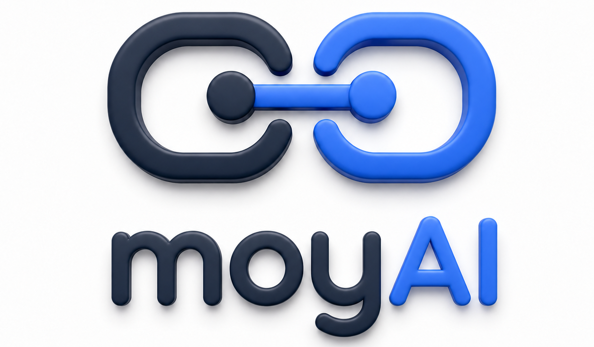
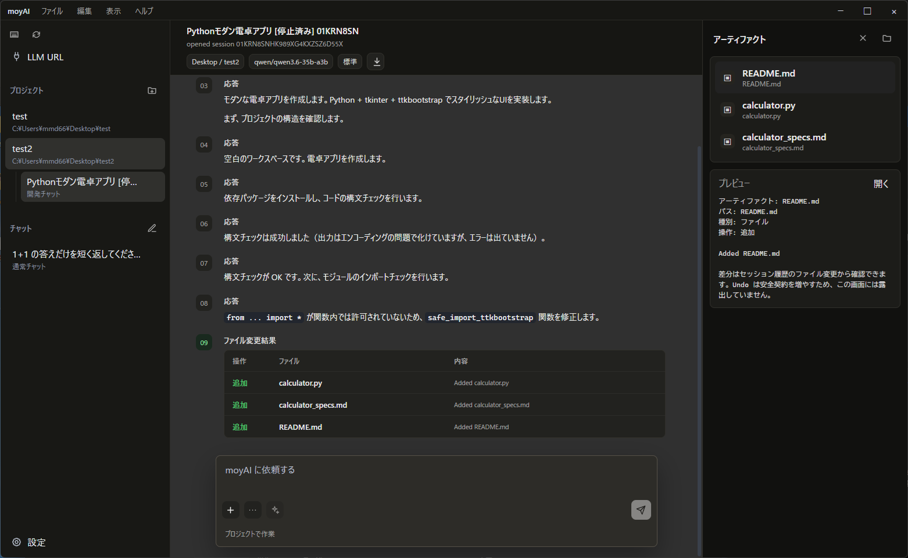

<p align="center">
  
</p>

<h1 align="center">moyAI</h1>

<p align="center">
  <strong>ローカルLLM と、閉鎖環境専用のコーディングエージェント。</strong>
</p>

<p align="center">
  <a href="https://github.com/midi-ai-labs/moyAI/releases/tag/v0.7.0"></a>
  <a href="LICENSE"></a>
  
  
  
</p>

<p align="center">
  <a href="README.md">English README</a>
  ·
  <a href="https://github.com/midi-ai-labs/moyAI/releases/tag/v0.7.0">release をダウンロード</a>
  ·
  <a href="#quick-start">Quick Start</a>
  ·
  <a href="#設定">設定</a>
</p>

<p align="center">
  
</p>

---

## moyAI（もやい） とは

moyAI は、ローカル LLM で動かすことを前提にした Rust 製の coding agent です。ローカルのあらゆるリファレンスが結ばれる様子をイメージし、もやい と名付けました。

OpenAI 互換 API を備えたローカル推論サーバーに接続し、プロジェクト調査、ファイル編集、shell 実行、セッション履歴の記録、検証までを扱います。CLI、TUI、Tauri Desktop App は、すべて同じ Rust core の上で動作します。

手元の開発作業で日常的に頼れるツールとすることを重視しました。作業証跡は見える形で残します。あとから「何を読んだのか」「何を変えたのか」「何を検証したのか」を追えるようにするためです。

## なぜ作ったか

最近の coding agent は非常に便利ですが、クラウド上のモデル、オンラインサービス、plugin marketplace、常時インターネット接続を前提にしているものも少なくありません。

一方で、機密情報・機密コードを扱う環境、社内ネットワーク、ローカル推論サーバー、再現性を重視する開発現場では、その前提が合わないことがあります。

moyAI は、そうした環境でも使いやすい開発用の相棒を目指しています。

| 方針 | 内容 |
| --- | --- |
| ローカル前提 | LM Studio などの OpenAI 互換 endpoint に接続します。 |
| プロジェクトを見て動く | 検索、読み取り、編集、patch、検証まで扱います。 |
| 作業内容を追跡できる | transcript、file changes、tool output、session history を残します。 |
| GUI でも terminal でも使える | Desktop、CLI、TUI を同じ Rust core で動かします。 |
| 閉域環境へ持ち込みやすい | デプロイで npm、Rust toolchain、internet、dev server を要求しません。 |
| 暗黙に環境構築しない | dependency install、runtime download、package-manager setup、外部repository取得をmoyAI自身が自動実行しません。ユーザーが依頼したshell commandは、現在のpermission policyで許可または確認された場合にnetworkへ接続できます。 |

## できること

- Project Chat / Quick Chat / Transcript / Artifact Pane / Settings を備えた Tauri Desktop App
- Desktop は1ユーザーにつき1 instanceだけ起動し、再起動操作では既存windowを復元
- terminal から利用できる CLI / TUI
- OpenAI 互換 local LLM への接続と model availability check
- 非自明な作業で canonical `update_plan` tool を使う、evidence-first のtask planning
- same-run `previous_response_id` continuity と typed reasoning summary を持つ LM Studio Responses API 対応
- `/v1/models` と LM Studio `/api/v1/models` からの model metadata discovery
- workspace search、directory inspection、guarded file read、diff-based edit、shell execution
- `default`、`auto_review`、`full_access` の3種類のpermission preset。Desktopの選択は次回起動用のglobal設定と、現在開いているroot sessionへ自動保存する。TUIのF8はroot sessionを開いている場合はそのsessionへ、開いていない場合はglobal設定へ保存し、child agent sessionからrootのaccess ownerを変更することはできない。`auto_review`は低riskの決定論的fast path外をtoolなしAI Reviewerで評価する。Reviewerはtyped JSONのallow / deny `outcome`を判定元とし、省略されたrisk、ユーザーauthorization、理由は安全な既定値へ正規化する。正常完了したallowだけを実行し、deny、unknown outcome、timeout、通信・形式・provider終端の不整合は人間確認へ戻す。`full_access`は設定済み境界内の検出riskを自動許可し、境界外だけを確認する。人間確認で「実行せず、指示を変更する」を選ぶと、そのconfirmationの要求toolだけを`Declined`、同じ中断で止まる他toolを`Cancelled`として、Sub Agent要求の場合もcurrent root taskを中断し、拒否結果をmodelへ返さない。内部的な「実行せず続行する」判断、外部Stop、運用失敗は別のtyped outcomeとして扱う。分類もAI reviewもOS filesystem sandboxではなく、commandは現在のユーザー権限で動く
- vision-capable model での画像添付
- Docling Serve / HTTP MCP と連携した document workflow
- `AGENTS.md`、`CLAUDE.md`、`.moyai/rules*`、`.moyai/commands/*.md`、local `SKILL.md` の読み込み
- protocol-first session history、Markdown export、軽量な live-smoke artifact
- child ごとの独立 session と Desktop activity 表示を持つ、任意有効化の multi-agent collaboration

## 現在のリリース

現在の beta release を公開しています。

[**moyAI v0.7.0 release**](https://github.com/midi-ai-labs/moyAI/releases/tag/v0.7.0)

Windows 向け release zip には、次のものが含まれています。

- CLI / TUI 用の `bin/moyai.exe`
- Desktop App 用の `bin/moyai-desktop.exe`
- bundled `ui/desktop-web/dist/` assets
- README、LICENSE、release notes、config example、manifest、SHA256 checksum

利用先の Windows 端末に、npm、Rust toolchain、internet access、local web dev server は不要です。

## Quick Start

1. LM Studio などで OpenAI 互換の local LLM server を起動します。
2. release zip をダウンロードして展開します。
3. `bin/moyai-desktop.exe` を起動します。
4. `LLM URL` で base URL と model を設定し、model discovery の結果を確認します。
5. まずは Quick Chat を試します。コードを扱わせる場合は、project workspace を選択し、開発チャットを開始します。

CLI から使う場合は、次のように実行します。

```bash
moyai run --dir /path/to/workspace "このプロジェクトの主要モジュールを調べて要約してください。"
moyai tui --dir /path/to/workspace
moyai desktop --dir /path/to/workspace
moyai-desktop
```

開発用 build:

```bash
cargo build
```

Desktop release build:

```bash
npm ci
npm run build:desktop-web
cargo build --release --bin moyai --bin moyai-desktop --bin moyai-cleanup
```

Windows release package:

```powershell
powershell -ExecutionPolicy Bypass -File scripts/package-release.ps1 -Version 0.7.0 -ManualGuiStResultsPath path\to\RESULTS.md
```

既定では、release artifact は repository の外側にある `project_sandbox/releases/` に出力されます。

## 設定

moyAI は、config file を 読みます。その上に environment variables と CLI overrides を重ねて適用します。

Windows の既定 config path:

```text
%APPDATA%\midi-ai-labs\moyai\config\config.toml
```

Desktop、TUI、CLI ともに、同じ設定を共通で参照します。

設定例:

```toml
[model]
base_url = "http://127.0.0.1:1234"
model = "qwen/qwen3.6-35b-a3b"
provider_metadata_mode = "lm_studio_native_required"
provider_api_mode = "auto"
reasoning_summary = "none"
context_window = 131072
supports_tools = true
supports_images = true
max_output_tokens = 8192

[model.extra_body_json]
num_ctx = 131072

[permissions]
access_mode = "auto_review"

[multi_agent]
enabled = false
mode = "explicit_request_only"
max_concurrent_agents = 4
max_concurrent_model_requests = 1

[docling]
enabled = false
base_url = "http://127.0.0.1:8123"

[mcp]
enabled = false
```

よく使う environment variables:

- `MOYAI_BASE_URL`
- `MOYAI_MODEL`
- `MOYAI_PROVIDER_METADATA_MODE`
- `MOYAI_PROVIDER_API_MODE`
- `MOYAI_CHAT_COMPLETIONS_REASONING_PARAMETERS`
- `MOYAI_REASONING_EFFORT`
- `MOYAI_REASONING_SUMMARY`
- `MOYAI_CONFIG_PATH`
- `MOYAI_DATA_DIR`
- `MOYAI_ACCESS_MODE`
- `MOYAI_REQUEST_TIMEOUT_MS`
- `MOYAI_STREAM_IDLE_TIMEOUT_MS`
- `MOYAI_CONTEXT_WINDOW`
- `MOYAI_MAX_OUTPUT_TOKENS`
- `MOYAI_SUPPORTS_IMAGES`
- `MOYAI_MULTI_AGENT_ENABLED`
- `MOYAI_MULTI_AGENT_MODE`
- `MOYAI_MULTI_AGENT_MAX_AGENTS`
- `MOYAI_MULTI_AGENT_MAX_MODEL_REQUESTS`
- `MOYAI_DOCLING_ENABLED`
- `MOYAI_MCP_ENABLED`

vLLM / vLLM-MLX のように OpenAI-compatible `/v1/models` だけを提供し、LM Studio native
`/api/v1/models` metadata endpoint を提供しない server では
`provider_metadata_mode = "openai_compatible_only"` または
`MOYAI_PROVIDER_METADATA_MODE=openai_compatible_only` を設定します。
この mode では、OpenAI-compatible chat request の system prompt 先頭に、qwen3.6 / vLLM 系
server 向けの language / no-thinking policy を必ず付与します。
Tauri Desktop の `LLM URL` overlay でも、provider URL と model list の横で同じ mode を切り替えられます。
同じ overlay で `context_window` と `max_output_tokens` も管理できます。vLLM / vLLM-MLX の
request limit を PowerShell の `$env:` ではなく moyAI の設定として保存・適用できます。
現在の vLLM-MLX は `/health` と `/v1/status` から hosted model name は取得できますが、server 起動時の
`--max-tokens` / `--max-request-tokens` は API に出ていません。そのため moyAI は model name を自動取得し、
provider が `/v1/models` に limit field を出す場合だけ自動反映し、それ以外は moyAI 管理の明示設定を使います。

`provider_api_mode = "auto"` が既定のtransport policyです。LM Studio native modeでは
`/v1/responses`、OpenAI-compatible-only modeでは `/v1/chat/completions` を選びます。
Responses transportはactive run内で`previous_response_id`を再利用し、完了済みresponseの後は
新しいtool outputやsteer inputだけを送ります。raw reasoning textはassistant contextとして再送・保存せず、
summaryを要求した場合だけtyped reasoning-summary eventを公開します。

reasoning controlは任意です。reasoning対応modelでは、例えば`reasoning_effort = "medium"`と
`reasoning_summary = "concise"`を設定できます。Responsesはtyped standard contractを使います。
Chat Completionsはprovider差があるため、`chat_completions_reasoning_parameters = "effort_only"`または
`"effort_and_summary"`を明示しない限り、reasoning parameterの送信をfail-closedにします。

## Multi-Agent Collaboration（任意有効化）

multi-agent collaboration は既定で無効です。Settings または config file で
`[multi_agent].enabled = true` にすると、model に `spawn_agent`、`send_message`、
`followup_task`、`wait_agent`、`interrupt_agent`、`list_agents` の 6 tools を公開します。

- `mode = "explicit_request_only"` では、ユーザーが agent、Sub Agent、委譲、並列 agent 作業を
  明示的に依頼した場合だけ委譲します。`mode = "proactive"` では、品質または待ち時間の改善に有効な
  bounded independent task を model が判断して委譲できます。
- 初版の tree depth は 1 段固定です。`spawn_agent` を呼べるのは root だけで、Sub Agent から別の
  Sub Agent を再 spawn することはできません。
- `max_concurrent_agents` は root を含む同時 active agent 数の上限です。既定値 `4` では root と
  child 最大 3 件が同時に実行できます。完了 agent は一覧と follow-up 用に保持しますが active 枠を
  消費しなくなるため、parent は別の bounded task を逐次 spawn できます。
- `max_concurrent_model_requests = 1` により、tree 内の local LLM model request は既定で直列化します。
  agent は tool 実行や review の前後では独立して進行できます。並列 request を安全に処理できる
  inference server の場合だけ値を増やしてください。
- child は parent と lineage で結ばれた別の durable session です。通常の project/session list には
  implementation 用 child session を表示しません。`spawn_agent` の `fork_turns` は既定の `"all"` と
  `"none"` を選べます。`"all"` でも複製するのは user turn と表示対象の assistant message だけで、
  reasoning、tool traffic、internal control item、permission evidence は含みません。
- Desktop は active な activity を本文内のクリック可能なAgentチップとして表示し、terminal後は履歴を
  1件の集約表示へ畳みます。本文またはOutputの集約表示をクリックすると、current root taskに紐づく
  read-onlyのSub Agent専用paneが開き、状態別の一覧、task、current work、result、child session IDを確認できます。
  child sessionへ画面遷移はせず、狭いwindowでは右側drawerとして表示します。permission promptは要求元agentを
  表示し、順番に処理します。current treeのいずれかのagentがactiveな間は、新規chat、session、project、
  workspaceへのnavigationを禁止します。これによりcurrent root taskの選択とpermission / Stopのroutingを
  維持します。Stopはtree全体を停止します。

## 起動時チェック

`moyai-desktop.exe` の cold start では、moyAI splash を最低 5 秒表示し、その間に次の状態を確認します。

- global config file の状態
- workspace の状態
- configured provider / model catalog
- Docling enabled 時の Docling Serve `/health` / `/ready`

設定が不足している場合や接続確認に失敗した場合は、メインウィンドウを開いたあとに Settings または LLM URL を自動で表示します。

## プロジェクトごとの指示

moyAI は repository local の instructions を読み込みます。

- `AGENTS.md`
- `CLAUDE.md`
- `.moyai/rules`
- `.moyai/rules-<route>`
- `.moyai/commands/*.md`
- `.moyai/skills/**/SKILL.md`

外部 plugin marketplace に依存せず、プロジェクトごとの運用ルールを repository 内で管理できます。

## 検証

手元でよく使う check は次のとおりです。

```bash
cargo fmt --all -- --check
cargo check --all-features
cargo test -- --test-threads=1
npm run test:desktop-web
npm run build:desktop-web
```

Desktop interaction を変更した場合は、実際の Tauri window を操作し、screenshot evidence を `../project_sandbox/<task>/` に保存します。build と startup だけでは UI behavior の証明にしません。

公開する release package は、upload 前に visible Desktop GUI の manual ST を gate として通します。
結果は `Manual ST Gate: PASS` を含む UTF-8 Markdown artifact に記録し、
`scripts/package-release.ps1 -ManualGuiStResultsPath ...` に渡してください。この artifact は
release zip の `docs/release/manual-gui-st-results.md` に同梱されます。

## 開発状況

moyAI は現在、主に Windows で開発・検証しています。主な検証構成は、LM Studio でホストした `qwen/qwen3.6-35b-a3b`、特に `lmstudio-community` 版です。

OpenAI 互換 model であれば他の model も利用できますが、tool-use quality、context length、vision support、応答速度は provider / model によって変わります。

## License

The moyAI application and source code are licensed under the MIT License.

Copyright (c) 2026 Hideyoshi Takahashi.

`midi-ai-labs` is the GitHub organization / project namespace for this personal project.

See [LICENSE](LICENSE) for the full license text.
