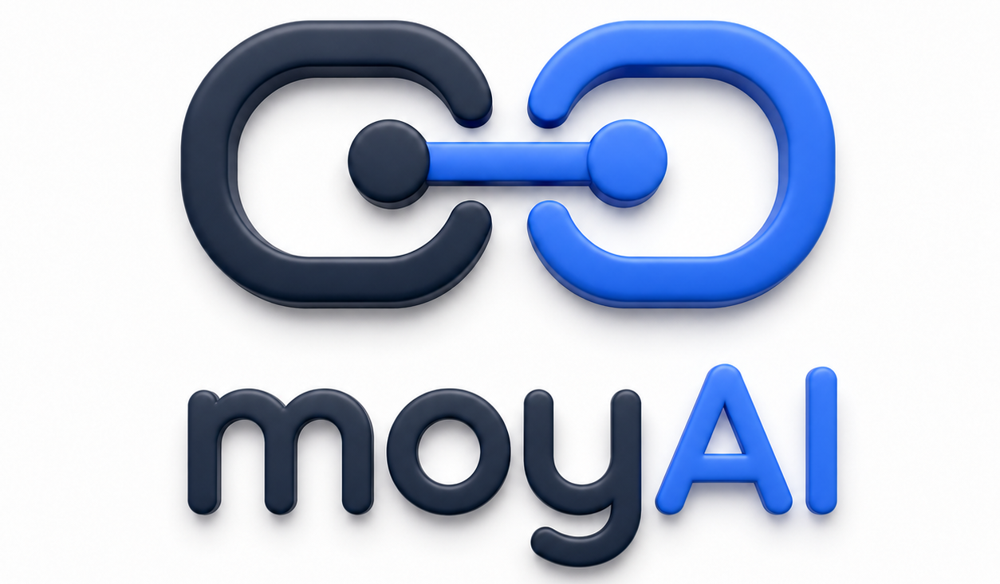
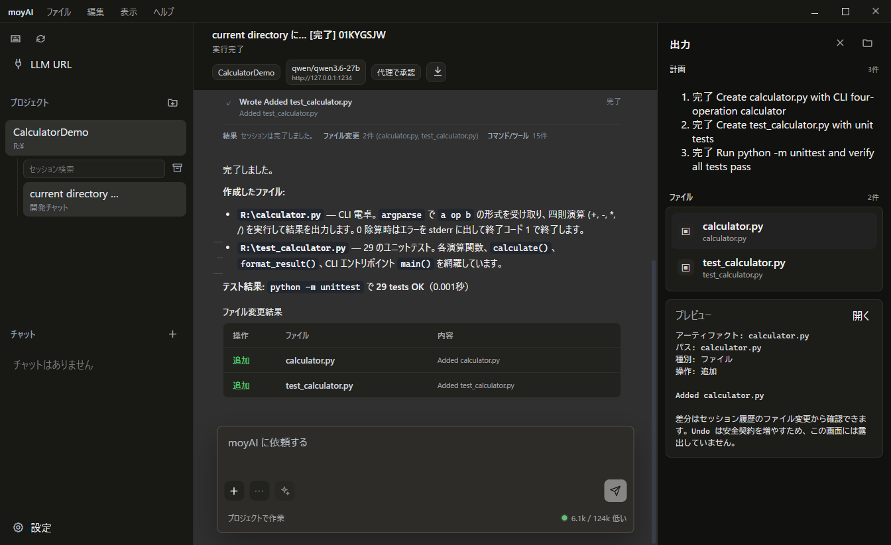

<p align="center">
  
</p>

<h1 align="center">moyAI</h1>

<p align="center">
  <strong>A local-first coding agent for private workspaces, local LLMs, and closed-network development.</strong>
</p>

<p align="center">
  <a href="https://github.com/midi-ai-labs/moyAI/releases/tag/v1.1.1"></a>
  <a href="LICENSE"></a>
  
  
  
</p>

<p align="center">
  <a href="README.ja.md">日本語 README</a>
  ·
  <a href="https://github.com/midi-ai-labs/moyAI/releases/tag/v1.1.1">Download release</a>
  ·
  <a href="#quick-start">Quick Start</a>
  ·
  <a href="#configuration">Configuration</a>
</p>

<p align="center">
  
</p>

---

## What Is moyAI?

moyAI is a Rust-based coding agent built for environments where cloud-first developer tools are hard to adopt.

It connects to an OpenAI-compatible local LLM server, reads and edits your workspace, runs shell commands, keeps session history, and presents the same agent core through a CLI, TUI, and Tauri Desktop app.

The focus is straightforward: keep the model local, keep the evidence visible, and keep the workflow useful for real engineering tasks.

## Why It Exists

Many coding agents assume hosted models, online services, plugin marketplaces, and constant internet access. That is not always realistic for private source code, internal networks, local inference servers, or reproducible engineering environments.

moyAI is designed around those constraints:

| Principle | What It Means |
| --- | --- |
| Local-first | Works with OpenAI-compatible local LLM endpoints such as LM Studio. |
| Workspace-aware | Searches, reads, edits, patches, and verifies files in your project. |
| Evidence-oriented | Keeps transcript, file changes, tool output, and session history inspectable. |
| GUI and terminal | Offers Desktop, CLI, and TUI entrypoints over the same Rust core. |
| Closed-network friendly | Release builds run without npm, Rust toolchain, internet, or a dev server on the target machine. |
| No implicit bootstrap | moyAI does not automatically install dependencies, download runtimes, set up package managers, or fetch external repositories. A user-requested shell command can still access the network when the active permission policy allows or confirms it. |

## Highlights

- Tauri Desktop app with project chat, quick chat, transcript, artifacts, settings, and provider discovery.
- Desktop renders canonical history as a continuous conversation: user bubbles and plain assistant responses have no display-only step numbers, completed work history is collapsible without swallowing the root Agent's final response, and older bounded chunks prepend in place with a left-side hover/jump rail instead of replacing the page.
- One Desktop instance per user; launching it again restores the existing window.
- Desktop Stop validates the projected workspace, root session, run generation, and Agent Tree epoch, so stale UI actions cannot cancel a later run. Settings values, baseline, dirty state, and monotonic revision exist only in one frontend-local draft owner. Rust projects typed clean/dirty capability variants and statelessly validates a complete draft plus a decimal-string config-generation target before Apply, Save, Reset, or another config-owner mutation. Commit builds one complete temporary `ResolvedConfig`, preserving cleared optional values instead of re-layering them. Active-turn steer clears input only after durable acceptance.
- CLI and TUI for terminal-centered workflows.
- OpenAI-compatible local LLM connection with explicit model availability diagnostics. moyAI connects to the configured external HTTP endpoint; it does not launch or supervise the provider process.
- Evidence-first task planning with canonical `update_plan` as a client-visible progress projection rather than an execution or tool-access gate. In proactive mode, static model instructions require minimum grounding followed by an early plan before broad investigation.
- One immutable `ResolvedTurnConfig`/turn/step context captured at admission, canonical protocol history, and atomic response-scoped assistant/raw-tool-call commits keyed by `ModelResponseId`.
- LM Studio Responses API support with full canonical HTTP input replay and typed reasoning summaries.
- Automatic LLM semantic compaction near the context threshold, using provider-reported total usage plus a Codex-style UTF-8-bytes/4 local suffix estimate, a full-request local fallback, full native summary requests with typed overflow reduction, and durable replacement lineage.
- LM Studio metadata discovery through `/v1/models` and `/api/v1/models`.
- Bounded workspace traversal/search/directory inspection with model-visible continuation cursors, guarded line-aware file-read pages with exact next offsets and no read spool path, diff-based edits, and shell execution.
- A selected nested directory remains the tool and sandbox authority boundary even when an ancestor is the Git project root; reopening its session restores that exact directory.
- File writes and patches use one stable-handle, no-clobber conditional commit for create, update, delete, and rollback. A concurrent external replacement wins without being overwritten; if restoration cannot reclaim the target name, moyAI reports the preserved backup path. Parent directories are not created implicitly, so create the parent first.
- On Unix, moyAI cannot prove that a writable descriptor opened before an update or delete no longer references the detached inode. Creation remains unchanged, but an existing-file update installs the new target and a delete detaches the target while retaining the old inode at a private backup path; both report a typed partial-commit error instead of claiming safe cleanup. Inspect and reconcile the reported backup because a pre-opened writer can still modify it.
- Permission modes: **Ask for approval** (`default` / 承認を求める), **Approve for me** (`auto_review` / 代理で承認), and **Full access** (`full_access` / フルアクセス). Ask and Auto share one deterministic admission policy and the same Windows `workspace-write` restricted-token/ACL profile; explicit `sandbox_permissions: "require_escalated"` plus `justification`, or a detected destructive/network/external/authority effect, goes to a human in Ask or a separate tool-less AI Guardian in Auto. The Windows backend identity-pins admitted roots and selected existing authority carveouts, content-pins protected regular files, gives each launched process/thread an explicit system-only descriptor, inherits only stdio, applies Job process-tree/UI restrictions before resume, and fails closed without an unrestricted retry. This unelevated profile is a finite existing-object defense, not a complete Windows namespace or Codex-enforcement equivalent: absent authority names, unrelated nested instruction files, protected descendants with overriding explicit/inheritance-disabled DACLs, uninspected outside paths, direct sockets, same-user host-process memory, and same-desktop synthetic input remain residuals. Its ACL preflight can propagate through existing trees synchronously and is not covered by the child timeout. Full Access and an approved process elevation run `Unrestricted` as the current user, so their child filesystem mutations do not pass through typed file guards; typed `write`/`apply_patch`, MCP/Docling, and process lifecycle checks keep their own guards. A committed mode change affects the next permission decision, while a pending request and an admitted effect retain their original decision/profile. Native process sandboxing is currently Windows-only; workspace-mode process effects fail closed elsewhere. A future elevated dedicated-identity/firewall/private-desktop backend is required for the hard boundary.
- Vision-capable model support for image attachments.
- Optional Docling Serve and HTTP MCP integration for document-heavy workflows.
- Local instructions from `AGENTS.md`, `CLAUDE.md`, `.moyai/rules*`, `.moyai/commands/*.md`, and local `SKILL.md` files.
- Canonical protocol session history, typed turn terminals, Markdown export, and lightweight live-smoke artifacts.
- Recursive multi-agent collaboration, available by default for explicit delegation requests, with the normal and collaboration tools available to every agent, separate descendant sessions, and visible Desktop activity.

## Current Release

The current release is available here:

[**moyAI v1.1.1 release**](https://github.com/midi-ai-labs/moyAI/releases/tag/v1.1.1)

v1.1.1 keeps a selected nested directory as the exact tool and sandbox authority boundary even when
an ancestor is the Git project root. Glob, typed file tools, shell effect review, Windows sandboxing,
session reopen, and built-in Git review now agree on that selected directory without losing
project-level Git identity or ancestor instructions.

The Windows release zip includes:

- `bin/moyai.exe` for CLI / TUI workflows
- `bin/moyai-desktop.exe` for the Desktop app
- `bin/moyai-cleanup.exe` for resetting user-wide moyAI AppData to first-run state
- bundled `ui/desktop-web/dist/` assets
- README files, license, release notes, config example, getting-started guide, and in-package SHA256 checksums

The GitHub Release publishes the zip together with its external manifest and zip SHA256 sidecar.

On the target Windows machine, you do not need npm, the Rust toolchain, internet access, or a local web dev server.

## Quick Start

1. Start, or connect to, an OpenAI-compatible LLM server reachable at the configured HTTP URL.
2. Download and extract the latest release zip.
3. Launch `bin/moyai-desktop.exe`.
4. Open `LLM URL`, set the base URL and model, then confirm model discovery.
5. Use Quick Chat, or select a project workspace and start a development chat.

CLI examples:

```bash
moyai run --dir /path/to/workspace "Inspect this project and summarize the main modules."
moyai tui --dir /path/to/workspace
moyai desktop --dir /path/to/workspace
moyai-desktop
```

Development build:

```bash
cargo build
```

Desktop release build:

```bash
npm ci
npm run build:desktop-web
cargo build --release --bin moyai --bin moyai-desktop --bin moyai-cleanup
```

Windows release package:

```powershell
powershell -ExecutionPolicy Bypass -File scripts/package-release.ps1 -Version 1.1.1 -ManualGuiStResultsPath path\to\RESULTS.md
```

Run packaging from the clean source commit for that release. If `v<version>` already exists, the
script permits a publishable rebuild only from the commit identified by that tag; use a newly
synchronized version for later source.

By default, release artifacts are written outside the repository under `project_sandbox/releases/`.

## Configuration

moyAI uses one user-wide config file, then applies environment variables and CLI overrides on top.

Default Windows config path:

```text
%APPDATA%\midi-ai-labs\moyai\config\config.toml
```

The release folder and workspace folders do not need their own config file. Desktop, TUI, and CLI all read the same user-wide settings.

Example:

```toml
[model]
base_url = "http://127.0.0.1:1234"
model = "qwen/qwen3.6-35b-a3b"
provider_metadata_mode = "lm_studio_native_required"
provider_api_mode = "responses"
reasoning_summary = "none"
request_timeout_ms = 1800000
stream_idle_timeout_ms = 1800000
context_window = 131072
supports_tools = true
supports_images = true
max_output_tokens = 32768

[model.extra_body_json]
num_ctx = 131072

[permissions]
access_mode = "default"

[multi_agent]
enabled = true
mode = "explicit_request_only"
max_concurrent_agents = 4
max_concurrent_model_requests = 1

[docling]
enabled = false
base_url = "http://127.0.0.1:8123"

[mcp]
enabled = false
```

`request_timeout_ms` is one response-start operation budget shared by connection attempts, connection
retry delays, request-body upload, and waiting for response headers. `stream_idle_timeout_ms` limits a period with no SSE
event after streaming starts. Both default to 1,800,000 ms (30 minutes). These two settings are configurable
no-progress deadlines, not the aggregate stream cap. Separately, after response headers, the product
applies a non-configurable aggregate stream-duration limit of 1,800,000 ms (30 minutes); increasing
either setting does not extend that bound. Explicit config or environment overrides for the two
no-progress deadlines remain supported.
`max_output_tokens` bounds the complete model output, including reasoning and serialized tool-call
arguments. Tool-heavy runs that write a whole document need the provider's verified profile budget;
the product default uses `32768`. A provider-side
`response.failed` such as `Failed to parse tool call: Unexpected end of content` is reported as a
generation failure with the configured budget and is not treated as a locally parsed or executed
tool call.
`max_retries` applies only to retryable connection/transport failures before any HTTP response, with
every retry delay capped at 30,000 ms. A response-start timeout, any HTTP error response (including
429/5xx), or a failure after an SSE response starts is terminal and is not replayed automatically.
The separate model-availability action uses its own 120,000 ms per-request probe deadline and does
not run as part of normal turn admission.
Desktop cold start validates only the local configuration: it does not load the provider catalog,
run the availability diagnostic, or probe Docling. Provider discovery starts only when the user
chooses model loading, and Docling connects only when an explicitly requested operation uses it.
Configuration parsing is strict at every nested section. Unknown or retired keys, including
`stream_max_retries`, are reported as errors instead of being silently retained as no-op settings.
The error names the exact config file that failed. Existing user-wide files are not silently rewritten:
remove or replace retired `stream_max_retries`, `[model_providers.*]`, and
`session.auto_compact_*` entries in the reported file before restarting.
Desktop keeps in-progress Settings values, their baseline, dirty state, and monotonic revision in one
frontend-local draft owner; Rust keeps no field-value, dirty, or revision mirror. Rust projects typed
clean and dirty semantic-capability variants, and the frontend selects the variant matching its local
dirty state while adding only local single-flight gates. Apply, Save, and Reset send a complete stable
key/value draft with the workspace/session/config-generation target. Access, Provider Apply/Save, and
Import send the same complete draft with their owner target. Rust statelessly validates draft
completeness, the current effective baseline, and admission before any side effect. Config generation
crosses the Rust/TypeScript boundary as an exact `u64` decimal string, never a JavaScript number.
Apply builds one complete temporary `ResolvedConfig`, so a cleared optional field remains absent
instead of inheriting a stale global/base value. Global Save separately merges only dirty fields into
the current TOML document. Only a correlated success matching the latest local revision and target
clears the frontend draft; a stale async response cannot mutate or clear a different draft.

When MCP is enabled, each callable server tool needs an explicit effect route. Unlisted routes fail
closed; in the internal Plan mode, only routes explicitly classified as `read` are callable.

```toml
[mcp]
enabled = true

[[mcp.servers]]
id = "internal"
enabled = true
transport = "http"
base_url = "http://127.0.0.1:8123/mcp"
timeout_ms = 120000

[[mcp.servers.tool_routes]]
name = "inspect"
effect = "read"

[mcp.servers.headers]
```

Common environment variables:

- `MOYAI_BASE_URL`
- `MOYAI_MODEL`
- `MOYAI_PROVIDER_METADATA_MODE`
- `MOYAI_PROVIDER_API_MODE`
- `MOYAI_CHAT_COMPLETIONS_REASONING_PARAMETERS`
- `MOYAI_REASONING_EFFORT`
- `MOYAI_REASONING_SUMMARY`
- `MOYAI_CONFIG_PATH`
- `MOYAI_DATA_DIR`
- `MOYAI_ACCESS_MODE`
- `MOYAI_REQUEST_TIMEOUT_MS`
- `MOYAI_STREAM_IDLE_TIMEOUT_MS`
- `MOYAI_CONTEXT_WINDOW`
- `MOYAI_MAX_OUTPUT_TOKENS`
- `MOYAI_SUPPORTS_IMAGES`
- `MOYAI_MULTI_AGENT_ENABLED`
- `MOYAI_MULTI_AGENT_MODE`
- `MOYAI_MULTI_AGENT_MAX_AGENTS`
- `MOYAI_MULTI_AGENT_MAX_MODEL_REQUESTS`
- `MOYAI_DOCLING_ENABLED`
- `MOYAI_MCP_ENABLED`

Use `provider_metadata_mode = "openai_compatible_only"` or
`MOYAI_PROVIDER_METADATA_MODE=openai_compatible_only` for OpenAI-compatible servers that do not
provide LM Studio's native `/api/v1/models` metadata endpoint, such as vLLM/vLLM-MLX.
Provider metadata mode does not select a model-name-specific prompt profile or inject a hidden
language / no-thinking prefix. Tool, image, and parallel capability have one owner in `ModelPolicy`;
provider policy owns only API mode and reasoning transport. Metadata mode selects exactly one
declared metadata endpoint, while `provider_api_mode` separately selects the generation wire
encoding. Availability is a metadata-only, explicit diagnostic; it does not run tool/vision
generations or mutate product capability config.
The current provider contract does not claim server-side strict tool-schema validation. Core and MCP
tool-schema Rust types and both Chat Completions and Responses wire formats have no `strict` field, while raw
arguments are still committed canonically and validated locally against the advertised schema, exact
router name, effect class, and permission boundary before dispatch. In particular, an LM Studio warning
that `strict=true` was ignored does not mean the model failed to load and does not explain a single
long-running generation.
moyAI treats the configured URL as an external HTTP service and never launches, stops, or supervises
the LM Studio process.
Provider reachability, catalog registration, and model-instance load state are separate facts. LM
Studio native metadata maps a non-empty `loaded_instances` array to `loaded`, an explicit empty array
to `not loaded`, and an absent load field to `unknown`; OpenAI-compatible catalog metadata remains
`unknown`. moyAI does not infer on-demand loading from catalog registration.
A saved LM Studio lab-profile example lives under `docs/testing/provider-profiles/`. It is not a
product default: copy it to an isolated config, update the endpoint/model for the current environment,
and select it with `MOYAI_CONFIG_PATH` without overwriting the user-wide config.
The Tauri Desktop `LLM URL` overlay exposes the same mode switch beside the provider URL and model list.
It also owns `context_window` and `max_output_tokens` inputs so vLLM/vLLM-MLX limits can be managed
inside moyAI instead of relying on shell environment variables. Current vLLM-MLX `/health` and
`/v1/status` responses expose the hosted model name, but not the server startup `--max-tokens` /
`--max-request-tokens` values, so moyAI auto-detects the model and keeps request limits as managed
config unless a provider exposes those fields in `/v1/models`.

`provider_api_mode = "responses"` is the default generation transport and posts to `/v1/responses`.
Choose `provider_api_mode = "chat_completions"` explicitly for a provider that requires
`/v1/chat/completions`. The retired string `auto` is accepted only at the config/serde input boundary
and normalized one way to `responses`; it is not a runtime mode and metadata mode no longer changes
the generation transport implicitly. The HTTP Responses transport sends the complete current
canonical input on every request, including any compaction checkpoint, and does not send
`previous_response_id`. Raw reasoning text is neither replayed nor stored as assistant context. A
requested typed reasoning summary is a runtime-only client event, not a durable conversation or
runtime row.

Every generation request has a runtime-only provider request ID and reports the phases
`attempt_started`, `request_in_flight`, `headers_received`, `first_progress`, `last_progress`, and
`provider_terminal`, plus attempt/elapsed data, a sanitized endpoint, and provider-reported token
usage on a successful terminal when the provider supplies it. Prepared-request diagnostics keep the
logical model-message count separate from the exact HTTP wire input-item count and serialized body
size, without retaining the body. These are transport
boundaries observed by moyAI; they do not infer provider-process startup, server-side acceptance, or
model-instance loading. A long `request_in_flight` phase establishes only that the operation has not
reached response headers. Before POST, moyAI bounds messages, tools, schemas, extra body, stop data,
images, and the exact serialized wire bytes. After headers, it also bounds raw stream bytes, events,
tool calls, arguments, idle time, and absolute stream duration.
For an explicit task-local audit, set `MOYAI_HTTP_REQUEST_CAPTURE_DIR` to an absolute directory.
The HTTP transport then writes the exact prepared outbound request JSON plus
API-mode/endpoint/byte-count, capture-stage, and provider-request-ID metadata. The shared request ID
joins this prepared DTO to runtime attempt and terminal phases; the file alone does not prove that a
network attempt started or that the provider received it. Normal sessions retain only redacted
diagnostics. On Unix, the capture directory and files are forced to owner-only `0700` / `0600`
permissions. On Windows, the directory and files inherit Windows ACLs, so choose a location whose
ACL grants access only to the intended account. When capture is explicitly enabled, a capture-write
failure fails request preparation instead of silently losing the evidence.

Reasoning controls are optional. A reasoning-capable model can use, for example,
`reasoning_effort = "medium"` and `reasoning_summary = "concise"`. Responses has a standard typed
contract. Chat Completions varies by provider, so reasoning parameters remain fail-closed unless
`chat_completions_reasoning_parameters = "effort_only"` or `"effort_and_summary"` is configured.
Canonical System and Developer sections remain distinct in the logical model context. At the
OpenAI-compatible wire boundary, moyAI folds them in order into top-level `instructions` for
Responses or one leading `system` message for Chat Completions; it never emits a `developer` role.

## Runtime and History Continuity

Each turn captures one complete `ResolvedTurnConfig` for model, provider target, operation deadlines,
the admitted permission preset, and remaining effective settings, then gives its single `TurnContext`
owner the turn/admission identity, selected policy, and durable collaboration-mode instruction. Partial
configuration is resolved only before admission and is not merged again by later runtime stages.
It also captures one turn-start wall-clock snapshot. Step/world-state refreshes reuse that snapshot so
a clock tick alone does not change model-visible time; an explicit `current_time` tool call still
performs a fresh read.
Session/workspace state remains in `SessionContext`, while the root-scoped agent context owns the
agent-tree role. Model, provider, deadline, multi-agent, and `RunConfigSnapshot` state remain immutable
through the turn. Permission decisions are the narrow exception: immediately before each decision,
moyAI reads the durable root-session access mode, including for child-agent requests. A committed
root-only mode switch therefore applies to the next permission request even in the active turn. It does
not rewrite an already displayed pending request or an already admitted effect. Each model request captures a `StepContext`
for the current world state, skills, and optional external-tool availability. The same step produces
the advertised tool schema, execution router, and effect classification, so visibility and safety are
not separate execution contracts. MCP effects come only from explicit per-server tool routes; an
unlisted route is rejected.
`WorldState` itself contains only environment, instructions, and time and does not enumerate tool
names: the request's `ToolSpecPlan` schema is the sole model-visible owner of tool availability. The
AutoReview Guardian receives the same tool-inventory-free world-state snapshot and an empty tool
surface; exact action evidence is carried separately.

The AutoReview Guardian receives a complete typed action-evidence object separately from the bounded
human-facing permission preview. MCP calls retain their normalized full arguments, configured target,
exact tool name, and credential-presence flag; Docling retains its exact endpoint, local path or source
URL, effective format/OCR/image/page options, and credential-presence flag. Secret values are not sent.
If redaction or invalid configuration makes the executable effect incomplete, AutoReview denies before
calling either the Guardian or a human. The Guardian request includes the current `WorldState`, bounded
active canonical task context, the current exact committed response/call, and bounded results of prior
tools in that same response. It has no tools, reasoning, or continuation, does not inherit task-generation
sampling/stop/arbitrary-extra-body controls, and has a 90-second total deadline.

Desktop binds a mode update made while only child agents remain active to the current root session and
the exact `tree:N` owner; only the matching completion from `tree:N` to `idle:N` is accepted. For a new
TUI root session, `RunSessionAccessModeAdoption` commits the latest pre-admission F8 selection to the
durable session before `SessionStarted` or the agent loop. Switching with a human prompt already pending
does not alter or settle that prompt; it affects only the next permission decision.

Canonical protocol history is the delivered conversation source of truth. A new user turn enters it
directly. An active-turn steer is first accepted into the durable turn-input queue and enters history
at the next safe model-request boundary with the same stable identity. If no further request is made,
a non-interrupted terminal drains the accepted steer into history before finishing; an interrupted
terminal records the interruption and discards the still-pending steer instead.
assistant messages, raw tool calls/outputs, collaboration-mode instructions, and compaction lineage are
stored as typed items. Each Rust history envelope has one `HistoryScope`: `Turn { turn_id }` for
user/steer, assistant/tool, compaction, and delivered mail, or `Session` for collaboration mode and
retained migrated session state. Newly accepted idle mail remains in the durable mailbox and is absent
from canonical history and export until an admitted turn delivers it. SQL stores that enum as a checked
`scope_kind` plus nullable `turn_id`; it never invents a turn ID for session state. A canonical tool call preserves the provider's `tool_name` and
`arguments_json` strings; typed-name parsing, JSON parsing, and schema validation are transient
execution steps. Assistant text and every raw tool call from one provider response share a
`ModelResponseId` and commit in one database transaction before any tool executes, so a partial
response cannot remain or be rewritten to `Invalid` / `null` when parsing fails.
Tool result title, metadata, output, and error live only in canonical `ToolOutput`; the tool sidecar
keeps lifecycle, truncation-path, and timestamp data. Committed durable events are published only
after their storage transaction; streaming deltas and reasoning summaries use a separate runtime-only
path and are not persisted as conversation fragments. A typed turn terminal's discriminated
`outcome` is the only owner of `completed`, `interrupted { cause }`, or `failed { error }`; session
status, finish reason, cause, and display summary are derived from it. Final response identity,
counts, and metrics travel in the same terminal value, and `RunSummary` hands that value across the
runtime boundary instead of restating its fields. Non-turn control commands do not synthesize a
successful turn terminal.
Protocol writes are limited to their atomic session/runtime owners. The generic protocol query/fork
surface cannot append arbitrary event bundles, and the runtime recording sink accepts only its explicit
projection allow-list rather than duplicating model/tool/file/terminal ownership.
TUI does not insert a submitted user/steer row or clear the composer optimistically. It tracks root-run
and steer submission identities, projects a new-user row after durable `UserTurnStored`, and shows an
accepted active-turn steer as a separate pending input rather than a transcript row. Delivery replaces
that pending projection with one canonical user row carrying the same stable identity. It clears only a
draft whose revision and text are still unchanged. A
pre-admission/storage failure or a post-submit edit keeps the draft and creates no phantom user row.
For a new root session, a pre-admission F8 access-mode change is adopted into that durable session before
`SessionStarted` and before the agent loop; F8 during an existing human permission prompt leaves the
prompt unchanged and applies the committed mode only to the next permission decision.
Prompt Enhance is single-flight under a request ID and cancellation token. During the request, `Esc`
cancels the provider while keeping the raw composer and the TUI running; `Ctrl+Q` cancels the provider
and pending review before quitting. A late completion after cancellation cannot reopen the review.

Durable run admission commits the run identity, turn identity, and lease together, so there is no
persisted state where a run owns the session without an active turn. One typed decoder validates the
session status/run/turn/lease quartet for every reader and mutation; partial IDs, non-positive leases,
and impossible idle/running owners fail closed. The same typed storage validator receives the session row
and exact-terminal count/payload from one SQL statement for single-session/list/projection/project/tree
reads, and receives same-transaction evidence for active-admission writes. `running` plus a terminal, or a
terminal status with a missing, duplicate, or status-mismatched
exact terminal, is corruption; admission, renewal, release, and expired replacement cannot normalize it
by clearing the owner. A turn ID is one-shot within its session: admission
rejects it when any canonical history, turn item, runtime event, append-order, or sequence-allocation
trace already exists. Project and Agent Tree gates decode every potentially invalid runtime candidate
before returning a remembered blocker, so a later corrupt row is not hidden; unknown persisted access
modes fail closed instead of becoming `default`. Stop and recovery capture the observed admission plus
turn as an opaque terminal target. A lease renewal by that same owner remains valid, while a replacement
run/turn cannot be terminalized through the stale target. If renewal observes a terminal, it returns the
requested turn's exact typed terminal from the same transaction instead of issuing a follow-up lookup.
User-turn bundles and `RunSummary` terminals
must also match the admitted session/turn identity. Session rollback, filtered fork, expired-run
recovery, and active mail-versus-terminal settlement each have one atomic storage/admission boundary.
In particular, mail acceptance appends only the bounded durable mailbox; it does not append canonical
history or rely on a process-local body copy. Safe delivery atomically changes one pending mailbox row
to delivered and creates the Turn-scoped history, turn item, and runtime event with the same stable ID.
Required direct-child results block an owner terminal until delivered. Ordinary mail arriving after a
visible final can remain pending for the next turn, while stop fences settle mail that must not survive.
Capacity rejection creates no mailbox row, history row, or local wake.

Desktop and TUI use bounded latest/offset canonical snapshots with a fence instead of eagerly loading
the whole history. Desktop can prepend adjacent older turn chunks into one continuous in-memory range,
reprojects turn boundaries after each merge, and keeps latest live/current refreshes under one
latest-wins owner so delayed snapshots cannot roll the transcript or terminal status backward.
Explicit Markdown export reads bounded pages and checks the append fence before it returns a complete
export. Runtime delivery uses bounded mailboxes with explicit backpressure. Accepted-but-unsampled
active steer content exists only in the durable turn-input queue and is not exported as conversation
history; after atomic delivery it is read from canonical history like any other user input. The
process-local wake-up is a coalesced generation signal that carries neither content nor an item
identity, and `wait_agent` also checks the durable queue so another process cannot strand input behind
the local signal. Best-effort harness recording disables only itself when initialization or writing
fails; it does not override the user-visible run/event result.

The V33 migration included in v0.8.0 losslessly backfills the legacy message graph into ordered canonical
protocol items before dropping the legacy tables. V37 converts a raw tool call only when a missing
provider-response identity can be recovered uniquely from canonical evidence in the same turn. With
zero or multiple candidates, the entire upgrade transaction rolls back and leaves the database
unchanged; it neither deletes the ambiguous turn nor introduces an unresolved current payload variant.
Back up the moyAI data directory before upgrading existing data. V38 historically mapped the then-retired
`auto_review` session value one way to `default` and rebuilt that schema's storage domain with only
`default` and `full_access`.
V39 rewrites legacy terminal JSON into the discriminated outcome contract, removes retired durable
retry/delta rows, and fails closed rather than inventing an interruption cause. V40 keeps only valid
flat root-to-direct-child spawn edges; nested edges are discarded without reparenting, while their
child session rows remain as independent sessions. V41 introduced the indexed latest
collaboration-mode lookup. V42 rebuilds canonical history with typed Turn/Session scope, converts old
mode pseudo-turns and terminal-less mail-only pseudo-turns with known projections into append-ordered
session state, and fails the whole migration on an unknown projection. V43 indexes durable truncation-
path ownership for exact bounded maintenance checks. Each maintenance tick advances process-local
`ReadDir` cursors shared across store clones instead of materializing all owners or entries, with at
most 64 live candidates across both namespaces and at most those 64 quarantine renames. Live and
quarantine roots must retain a stable, non-link identity inside the canonical data root; Windows
reparse points, including junctions, fail closed. Orphan harness directories are matched by
both run ID and artifact root, while truncation files use the indexed exact path owner. Both are
atomically detached into a same-volume maintenance quarantine under the producer fence. Destructive
operations never re-resolve the enumerated string path: Windows binds rename/delete to the same
opened entry handle and a stable destination-directory handle, while Unix uses no-follow stable
directory descriptors and single-component relative operations with an immediate identity check.
After the fence is released, a shared `ReadDir` frame stack drains that quarantine without recursive
bulk deletion, keeping filesystem entries examined plus mutation attempts within 64 per tick.
Current-schema opens validate only bounded schema shape; the full payload audit remains part of the
migration cutover.
V44 adds a partial unique index that permits exactly one terminal runtime event per session/turn.
Migration rolls back without recording its marker when duplicate terminals already exist, and current
opens validate the index table, key order, and predicate. Terminal readers also detect a second row and
fail closed rather than relying on the index alone.
V45 restores the current three-value session access domain: `default`, `auto_review`, and `full_access`.
Values already collapsed to `default` by V38 cannot be distinguished from genuine Default choices and
are therefore not reconstructed; users can explicitly select Auto Review again after the upgrade.
V46 upgrades recoverable stored v1 compaction rows to the `user_anchored_checkpoint` layout by
reconstructing bounded real-user anchors from canonical append order. Rows whose real-user text cannot
be recovered remain explicit `legacy_prefix` checkpoints without changing their effective ordering.
The migration validates JSON, hashes, session-local replacement lineage, and anchor bounds, rewrites
compaction rows in bounded pages, and rolls back without its marker when validation fails.
V47 is the current spawn-edge schema. It preserves the flat edges that survived historical V40, then
allows recursive Sub Agent lineage while validating each canonical `/root/...` path against its
immediate parent. It also prevents deletion that would orphan descendants and bounds each retained
tree at 256 agents including the root. Nested edges discarded by V40 cannot be reconstructed.
V48 added durable OwnerResume requests and deferred completion receipts for early success or
recoverable crash failure. Existing early-success rows remain readable for compatibility; current
runtime creates deferred receipts only for crash recovery. V49 adds durable tree-stop fences so
explicitly stopped subtrees, causes, and root boundaries cannot be resurrected after restart. V50
moves `NEW_TASK`, `MESSAGE`, and `FINAL_ANSWER` into the bounded durable mailbox. Current child
completion is queue-only for its exact direct parent and does not create OwnerResume; delivery
rehomes that exact mailbox identity into Turn-scoped canonical history.
V51 adds the durable active-steer FIFO, pending projection, terminal drain-or-discard rules, and the
durable/final timeout rechecks used by cross-process `wait_agent`. Root, cross-session sources,
ambiguous state, and terminal deferred states without an exact later resolver fail closed.
V52 binds every native harness run to its exact canonical session and turn. Ambiguous, missing,
duplicate, or cross-session backfill fails atomically without leaving the marker or a partial
mutation. V53 adds an immutable claim from each explicit mailbox wake to its recipient session,
admission, and turn; an existing OwnerResume remains bound to its exact claimed turn. Completed and
Failed settlement delivers only that selected wake into the claimed turn, Interrupted settlement
discards only that wake, and later triggers remain pending for a later admission. Current opens
validate both the V53 schema and these identities.

The default tool surface exposes `update_plan` for non-trivial work. Its structured result is a
client-visible plan projection: moyAI does not interpret plan text to select the next tool, end the
turn, trigger compaction, or unlock another tool surface. A durable Plan mode exists internally, keeps
`update_plan`, and hides mutation tools, but no CLI, TUI, or Desktop mode selector is currently
exposed.

At the model policy's 90% working target, moyAI selects model-visible semantic units rather than a
fixed item count. When available, the latest provider-reported total is rehydrated from the durable
turn terminal and combined with only the local items appended after that model response. Otherwise,
the full prepared request uses the same coarse UTF-8-bytes/4 fallback as Codex. Request diagnostics
identify which source was used. One provider response's assistant text,
calls, and settled outputs stay together; no compaction is attempted while a tool response is
unsettled. Summary generation keeps the base instructions and native User / Assistant / tool
structure, appends the Codex checkpoint prompt as the final User input, and sends no tools or provider
cursor. It first sends that full native request. Only a typed `context_length_exceeded` response removes
the oldest provider-native item (and its exact call/output counterpart when required) before retrying;
there is no semantic map/reduce path.
The exact checkpoint text in `assets/prompts/compaction.md` is a source-level Codex prompt-asset
contract; that text match does not claim full Codex runtime parity.

The resulting checkpoint retains the newest real User and Steer text inputs in original order
within a conservative 20,000-token budget. One boundary input is middle-truncated instead of being
dropped whole, and the prefixed summary is the final User input; old summaries are never promoted to
anchors. A delegated turn's canonical `NEW_TASK` remains an anchor, while ordinary agent messages and
final handoffs belong in the summary. The exact replacement lineage is committed while original
history remains stored. If cancellation occurs or summarization otherwise fails, history remains
unchanged. A non-empty summary is also rejected when the projected replacement is not smaller or the
projected complete request still reaches the 90% working target. Automatic compaction is attempted at
most once in that turn; below the hard limit the original history continues, and at the hard limit
the run fails explicitly. The working target is 90% of the advertised context window and the
Codex-style effective full input limit is 95%; an additional configured overflow margin is applied
only when it keeps the hard limit strictly above the working target. `max_output_tokens` is solely a
generation cap and does not reserve input tokens or lower either context limit.

An active session goal is not declared successful after an arbitrary number of idle continuations. It
continues until the goal state, its token/elapsed budget, cancellation, or a typed terminal provides a
semantic stopping condition.

## Multi-Agent Collaboration

Multi-agent collaboration is available by default and normally exposes these six tools to the model:
`spawn_agent`, `send_message`, `followup_task`, `wait_agent`, `interrupt_agent`, and
`list_agents`. Set `[multi_agent].enabled = false` in Settings or the config file to hide them.

- `mode = "explicit_request_only"` delegates only when the user explicitly requests agents,
  sub-agents, delegation, or parallel agent work. `mode = "proactive"` also lets the model delegate
  bounded work when doing so materially improves speed or quality.
- The `multi_agent_root.md` / `sub_agent.md` assets keep source-aligned Codex role and
  message-lifecycle fragments separate from explicitly labelled moyAI local-model coordination.
  The latter adapts direct-tool invocation to moyAI's flat names and adds delegation, evidence
  handoff, and instruction-authority safeguards; the complete assets are not byte-identical Codex
  prompts. The proactive asset likewise keeps the Codex activation text intact, then labels a local
  adaptation of Codex delegation guidance: a high-level plan separates the immediate blocker kept
  local from concrete, self-contained parallel sidecars; root and coding-child work must not overlap,
  root continues non-overlapping work, waits only when the critical path needs a result, and reviews
  returned patches before integration. These static instructions do not create a runtime gate, fixed
  DAG/stage router, or dynamic behavior-correction layer, and do not claim full Codex runtime parity.
- Every agent retains its normal tools and the six collaboration tools under the same model, mode,
  provider, and configuration filters. Spawning does not move the parent onto a collaboration-only
  surface, and `update_plan` does not unlock workspace tools. If the resolved model does not support
  tools, the request has no tool surface and moyAI omits the role/mode messages that would instruct
  it to call collaboration tools.
- Any agent may spawn another agent. The new task name is joined to the caller's canonical path:
  `/root/task1` spawning `task_3` creates `/root/task1/task_3`. Relative agent references resolve from
  the current agent; canonical absolute paths address agents elsewhere in the same tree.
- Each agent remains responsible for its assigned objective and for integrating children it creates,
  while the model chooses concrete bounded subtasks from current evidence. The host does not create a
  planner DAG or fixed scout/stage router.
- The root retains the task-wide plan, integrates child results, and performs final verification.
  Each child returns a concise handoff with outcome, supporting evidence, intentionally changed
  paths, verification and results, and remaining unknowns or risks. The root uses that handoff as
  working evidence instead of rebuilding private investigation; final verification checks the
  delegated acceptance criteria and resulting workspace state, inspecting only missing or
  conflicting evidence.
- A descendant's newest host-delivered `NEW_TASK` plus later host-delivered parent messages defines
  delegated scope only within system, developer, applicable project/skill, and user instructions.
  Parent-supplied findings and decisions are working context, not higher-priority instructions or
  independently verified facts. Quoted or embedded external content remains data unless a system,
  developer, or user instruction adopts it. The descendant inspects only gaps needed for its scope,
  avoids repeating private grounding, and returns the evidence handoff above.
- `max_concurrent_agents` is the root-inclusive limit for simultaneously active agents. The default
  `4` therefore allows the root plus at most three active descendants anywhere in the tree. The
  internal execution limiter excludes the root and derives those three descendant slots from the
  root-inclusive public value. Completed agents remain listed and available for follow-up work but
  no longer consume an active slot. The retained registry is
  bounded at 256 entries including the root (at most 255 descendants at any depth); once full,
  another spawn is rejected rather than evicting history or reusing a spawn order.
- `max_concurrent_model_requests = 1` keeps local-LLM model requests within the tree serialized by
  default, while agents can still make progress independently around tool and review work. Raise it
  only when the configured inference server can safely sustain parallel requests. Both concurrency
  limits are captured when the retained agent scheduler is first loaded. Later root turns reuse that
  scheduler and model-request semaphore; a different value is rejected before model sampling rather
  than mutating a live tree. Start a new session, or reopen the session in a new process, to use
  different limits.
- `wait_agent` defaults to 30,000 ms, accepts 10,000 through 3,600,000 ms, and returns immediately
  when agent activity or active-turn user input arrives. Callers can request a longer bounded wait
  when the task specifically requires it.
- Each descendant is a separate durable session linked to its immediate parent and tree root. Normal
  project/session lists keep those implementation sessions hidden. `spawn_agent` accepts
  `fork_turns = "all"` (the default), `"none"`, or a positive integer string for only that many recent
  turns. `"all"` streams the parent's active history in bounded pages under a stable append fence and
  copies the currently active user turns, plain final assistant messages owned by successfully
  completed terminals, durable collaboration-mode instruction, and active compaction summary.
  History replaced by that summary is not resurrected, and reasoning, tool traffic, retired control
  state, and permission evidence are not copied. Target-session existence is checked in the same
  transaction; a fence mismatch or mid-copy failure rolls back the entire fork. Sub Agent activity is
  recorded only while its owning root session has a fresh active turn.
- A live agent keeps the configuration, workspace, and permission broker captured for that agent
  execution. Spawn inherits the caller's resources, and a follow-up uses the exact target's retained
  resources; starting a new root turn never rewrites a still-running child. Project/session/workspace
  navigation replaces only the view's workspace-specific run service: the process scheduler, session
  event hub, and active Agent Trees remain the same owners, and each admitted execution keeps its
  exact run service. On process restart,
  lineage rehydration follows Codex's resume boundary: the current root resume configuration,
  workspace, and permission broker are supplied to every restored descendant instead of partially
  rebuilding a child configuration from session columns.
- Spawn, follow-up, ordinary message, and child completion remain typed Agent items and Codex-style
  `NEW_TASK`, `MESSAGE`, and `FINAL_ANSWER` envelopes at the canonical-history boundary. At the final
  OpenAI-compatible adapter, providers without Codex's `agent_message` type receive the preserved
  envelope as a standard `user`-role message. The accompanying logical Developer instruction treats
  that compatibility representation as delegated working context within system, developer, project/
  skill, and original-user constraints. A child's `FINAL_ANSWER` goes to its immediate parent, which receives the concise
  evidence handoff rather than the private investigation transcript. Child-session creation, the recursive edge, the requested
  history fork, and the initial `NEW_TASK` are one transaction. Before admission, a launch failure
  settles that exact trigger as `Failed` and atomically sends one terminal handoff to the immediate
  parent; cancellation settles it as `Interrupted` without a success-like handoff. A follow-up starts
  only its exact target and does not wake an inactive ancestor first. Its durable `trigger_turn`
  intent is distinct from whether storage authorizes an immediate execution. A ready inactive target
  reserves one descendant slot before its pending durable mailbox item is appended; if capacity is
  unavailable, no mailbox row, canonical history, or process-local wake is added. Mail for an active
  target does not consume another slot.
- Like Codex threads, each root or descendant owns its terminal independently of descendant
  liveness. `Completed`, `Failed`, and target-only `AgentInterrupted` neither wait for nor cancel
  descendants. If an answer depends on a child result, the model must call `wait_agent` before
  returning its final response. Permission Abort stops only the requesting execution, and ordinary
  User Stop stops only the exact current root execution. Neither cascades to siblings or descendants.
  Only the separately named explicit tree-stop operation is allowed to stop the retained tree.
- A child terminal creates one durable `FINAL_ANSWER` for its exact immediate parent with
  `trigger_turn = false`; it never bubbles to root or auto-resumes a terminal parent. An active
  parent can receive it at a safe mailbox boundary. If it races a non-interrupted terminal while
  current-turn delivery is still eligible, the terminal writer records it in canonical IAC history
  in the same transaction without another model sample. Mail assigned to the next-turn phase stays
  pending and is available to the parent's next explicit turn. A late child result never rewrites
  the parent's existing terminal.
- Historical V48 `completed_early` rows remain readable and stoppable for storage compatibility,
  but current normal completion never creates them. Deferred completion is current only for
  `crash_failed` recovery.
- A crashed OwnerResume turn re-pends the same request without leaking the crash failure upstream.
  Retry success/failure supersedes the crash receipt, interruption discards it, and repeated crashes
  roll the single pending receipt forward. An explicit follow-up to the crashed owner is instead a
  schedule-ready ExplicitTask and takes precedence over OwnerResume; the same recovery applies when
  the crash has no OwnerResume source. Its retry Completed / Failed terminal supersedes the old crash
  receipt, while Interrupted discards it. Every live current-OwnerResume read and post-admission
  projection shares the mail-delivery fence and authoritatively replaces stale local R1 with durable
  `None` or R2; rollback rejects a turn still named by any OwnerResume claim. Shared startup bootstrap
  restores the exact readiness and performs crash recovery before rehydrating the Agent Tree.
- Every continuation turn receives a fresh run control. Ordinary Stop targets that exact active
  continuation and does not reopen an earlier terminal or cancel detached children. The separate
  explicit tree-stop operation closes the retained tree, settles dormant follow-ups, and discards
  their deferred owner state so a later restart cannot revive explicitly stopped work.
- Desktop coalesces each turn's Sub Agent lifecycle events by `agent_path` into one compact, individually
  clickable stable-icon job with its task preview and latest status inside that turn's collapsible activity group; the root Agent's final response
  remains the next normal assistant message. Activating a job, or the compact summary in Output,
  opens a right pane: the list is grouped by status and each selected child shows its read-only bounded
  canonical execution transcript. Older child execution pages can be prepended in place from that pane;
  only a Running child with an exact projected active turn exposes an interrupt action, which returns
  workspace/root/path/child/turn identity and rejects stale or forged targets.
  each read stays bounded and reprojects the complete loaded range across turn boundaries. It does not navigate to or select the child session, rejects stale
  workspace/root/agent/child responses, and becomes a right-side drawer in narrow
  windows. Permission prompts identify the requesting agent and are serialized. Detached child
  liveness alone does not block new-chat, session, project, or workspace navigation, and a new root
  request can start after the prior root terminal while children continue independently. Desktop
  Stop targets the exact selected root execution; whole-tree cancellation remains a separate,
  explicitly named destructive operation.
- Rust supplies typed session status, transcript-row kind, and cancel availability to Desktop. The
  frontend does not infer them from labels, and a turn without a durable terminal is shown as
  incomplete rather than completed.

## Startup Checks

On cold start, `moyai-desktop.exe` shows the moyAI splash for at least five seconds and validates
local values only:

- global config file state
- workspace availability
- configured provider base URL and model value
- configured Docling enabled flag and base URL

The splash does not wait for network activity. Cold start sends no provider catalog, availability,
or Docling health request. Invalid local settings open Settings or LLM URL; live connectivity is
checked only by the explicit model-load/diagnostic action or when the configured service is used.

## Project Instructions

moyAI loads local project instructions from:

- `AGENTS.md`
- `CLAUDE.md`
- `.moyai/rules`
- `.moyai/rules-<route>`
- `.moyai/commands/*.md`
- `.moyai/skills/**/SKILL.md`

This keeps project behavior local to the repository and avoids depending on an external plugin marketplace.

## Verification

Useful local checks:

```bash
cargo fmt --all -- --check
cargo check --all-features
cargo test -- --test-threads=1
npm run test:desktop-web
npm run build:desktop-web
```

Desktop interaction changes also require operating the actual Tauri window and saving screenshot evidence under `../project_sandbox/<task>/`; a build and startup check alone do not prove UI behavior.

Published release packages must also pass a visible Desktop GUI manual ST before upload.
Record the result in a UTF-8 Markdown artifact containing `Manual ST Gate: PASS`, then pass that
file through `scripts/package-release.ps1 -ManualGuiStResultsPath ...`; the artifact is copied into
the release zip under `docs/release/manual-gui-st-results.md`.

## Status

moyAI is currently developed and tested primarily on Windows. The main development profile uses `qwen/qwen3.6-35b-a3b` hosted by LM Studio, especially the `lmstudio-community` build.

Other OpenAI-compatible models can be used, but model behavior, tool-use quality, context length, and vision support vary by provider and model.

## License

The moyAI application and source code are licensed under the MIT License.

Copyright (c) 2026 Hideyoshi Takahashi.

`midi-ai-labs` is the GitHub organization / project namespace for this personal project.

See [LICENSE](LICENSE) for the full license text.
